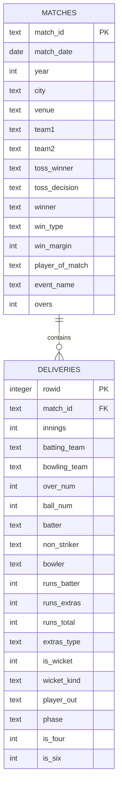

# 🏏 CricView — SaaS Product Architecture

> **Platform**: Cricket Intelligence & Analytics SaaS  
> **Version**: 1.0 MVP  
> **Date**: 2026-04-23

---

## 1. Product Vision

### 1.1 Core Value Proposition

**CricView** is a data-driven cricket intelligence platform that transforms raw match data into actionable insights for fans, analysts, and fantasy players.

**What CricView does BETTER than existing platforms:**

| vs. Competitor | CricView Advantage |
|---|---|
| **ESPNcricinfo** | Interactive analytics dashboards, not static scorecards. Phase-wise (PP/Middle/Death) breakdowns on every player. |
| **Cricbuzz** | Predictive models, win probability, player form indices — not just results. |
| **HowStat** | Modern UX, radar comparisons, story-driven insights — not 1990s HTML tables. |
| **Fantasy Apps** | Derived intelligence (Impact Score, Consistency Index) not available elsewhere. |

### 1.2 Target User Segments

| Segment | Size | Needs | Willingness to Pay |
|---|---|---|---|
| **Casual Fans** | 80% | Quick stats, "who's the best?" answers | Low (ad-supported) |
| **Fantasy Players** | 15% | Form indices, matchup data, venue intelligence | Medium ($5-10/mo) |
| **Data Analysts** | 3% | Raw data access, API, CSV exports, custom queries | High ($20-50/mo) |
| **Content Creators** | 1.5% | Shareable charts, embeddable widgets, data citations | Medium ($10-20/mo) |
| **Coaches/Teams** | 0.5% | Phase analysis, player development tracking, opposition reports | High ($100+/mo) |

### 1.3 Unique Differentiators

1. **Impact Score™** — Weighted metric combining runs, strike rate, boundary%, match situation difficulty
2. **Phase Intelligence** — Every stat broken into Powerplay / Middle / Death for batters AND bowlers
3. **Consistency Index** — Standard deviation analysis to surface "reliable" vs "volatile" players
4. **Venue DNA** — Pitch behavior profiling (pace vs spin, high-scoring vs low-scoring, toss advantage)
5. **Smart Insights** — Auto-generated natural language insights ("Kohli's SR drops 23% vs left-arm pace in Australia")

---

## 2. System Architecture

### 2.1 Architecture Diagram

```mermaid
graph TB
    subgraph "Data Layer"
        A["Raw JSON Files<br/>(~2,800 Cricsheet)"] -->|ETL Pipeline<br/>scripts/ingest.py| B["SQLite DB<br/>cricket.db"]
        B -->|Pre-aggregate| C["Parquet Cache<br/>data/processed/"]
    end

    subgraph "Application Layer (Streamlit)"
        C -->|@st.cache_resource| D["Data Loader<br/>src/data_loader.py"]
        D --> E["Analysis Engine"]
        E --> E1["batting_analysis.py"]
        E --> E2["bowling_analysis.py"]
        E --> E3["team_analysis.py"]
        E --> E4["predictions.py"]
    end

    subgraph "Presentation Layer"
        E --> F["Component System"]
        F --> F1["KPI Cards"]
        F --> F2["Filters"]
        F --> F3["Chart Factory"]
        F --> G["6 Dashboard Pages"]
    end

    subgraph "Future SaaS Layer"
        H["FastAPI Backend"] --> I["Auth (JWT)"]
        H --> J["Subscription (Stripe)"]
        H --> K["API Access"]
        D --> H
    end
```

### 2.2 Tech Stack Decisions

| Decision | Choice | Rationale |
|---|---|---|
| **Framework** | Streamlit (MVP) → Next.js (Scale) | Streamlit = fastest path to working analytics dashboard with Python data stack. Next.js migration when user system/payments needed. |
| **Database** | SQLite → PostgreSQL | SQLite: zero-config, handles 700K rows. PostgreSQL when multi-tenant needed. |
| **Cache** | Parquet files → Redis | Parquet: loads in <500ms, no infrastructure. Redis when real-time/multi-user. |
| **Charts** | Plotly | Interactive, dark-theme native, Streamlit `st.plotly_chart()` integration. |
| **ML** | scikit-learn | Win probability & form index are tabular regression. No GPU needed. |
| **Deployment** | Streamlit Cloud → Docker/AWS | Streamlit Cloud for MVP; Docker for scale. |

### 2.3 Folder Structure

```
CricView/
├── app.py                          ← Entry point (page config, branding)
├── pages/
│   ├── 1_Overview.py               ← Global KPIs + trends + map + insights
│   ├── 2_Player_Stats.py           ← Individual player deep-dive
│   ├── 3_Comparison.py             ← Player/Team comparison engine
│   ├── 4_Overall_Analysis.py       ← Historical trends & intelligence
│   ├── 5_Team_Analytics.py         ← Team-specific breakdowns
│   └── 6_Year_Explorer.py          ← Season-by-season analysis
├── src/
│   ├── __init__.py
│   ├── data_loader.py              ← Loads parquet + exposes DataFrames
│   ├── batting_analysis.py         ← All batting analytics
│   ├── bowling_analysis.py         ← All bowling analytics (NEW)
│   ├── team_analysis.py            ← Team-level aggregations
│   ├── charts.py                   ← Reusable Plotly chart factory
│   └── predictions.py              ← ML models (win prob, form index)
├── components/
│   ├── __init__.py
│   ├── kpi_card.py                 ← Premium KPI card component
│   ├── filters.py                  ← Multi-select filter panel
│   └── styles.py                   ← CSS injection system
├── config/
│   ├── __init__.py
│   ├── theme.py                    ← Color palette, chart defaults
│   └── constants.py                ← Phase definitions, team lists
├── scripts/
│   └── ingest.py                   ← ETL: JSON → SQLite → Parquet
├── data/
│   ├── processed/                  ← Parquet cache (gitignored)
│   └── cricket.db                  ← SQLite database (gitignored)
├── .streamlit/
│   └── config.toml                 ← Dark theme config
├── requirements.txt                ← Pinned deps
└── README.md
```

---

## 3. Database Schema

### 3.1 Tables



### 3.2 Pre-aggregated Views (Parquet)

| File | Columns | Purpose |
|---|---|---|
| `matches.parquet` | All match-level data | Quick match lookups |
| `deliveries.parquet` | All ball-by-ball data | Core analysis source |
| `player_batting.parquet` | Player, matches, innings, runs, SR, avg, 4s, 6s, phase splits | Player stats page |
| `player_bowling.parquet` | Bowler, overs, wickets, economy, avg, dot%, phase splits | Bowling analytics |
| `team_stats.parquet` | Team, W/L/T, win%, avg score, PP/death scores | Team page |
| `venue_stats.parquet` | Venue, city, matches, avg 1st/2nd score, toss advantage | Venue intelligence |

---

## 4. Monetization Strategy

### 4.1 Freemium Tiers

| Feature | Free | Pro ($9/mo) | Analyst ($29/mo) |
|---|---|---|---|
| Overview dashboard | ✅ | ✅ | ✅ |
| Player basic stats | ✅ | ✅ | ✅ |
| Phase-wise analysis | ❌ | ✅ | ✅ |
| Player comparison (radar) | 1/day | Unlimited | Unlimited |
| Team analytics | Basic | Full | Full |
| Win probability model | ❌ | ✅ | ✅ |
| Player form index | ❌ | ✅ | ✅ |
| CSV/PDF export | ❌ | ❌ | ✅ |
| API access | ❌ | ❌ | ✅ |
| Custom queries | ❌ | ❌ | ✅ |
| Ads | Yes | No | No |

### 4.2 Revenue Projections (Year 1)

| Metric | Target |
|---|---|
| Free users | 50,000 |
| Conversion to Pro | 3% = 1,500 × $9 = **$13,500/mo** |
| Conversion to Analyst | 0.5% = 250 × $29 = **$7,250/mo** |
| **Total MRR** | **$20,750/mo** |
| **ARR** | **$249,000** |

---

## 5. Feature Roadmap

### Phase 1: MVP (This Build) ✅
- [x] ETL pipeline (JSON → SQLite → Parquet)
- [x] Overview page with premium KPIs
- [x] Player Stats with phase analysis
- [x] Player/Team comparison with radar charts
- [x] Overall trend analysis
- [x] Team analytics with opponent filter
- [x] Year explorer
- [x] Bowling analytics
- [x] Premium dark theme design

### Phase 2: Intelligence (Week 5-8)
- [ ] Win probability model
- [ ] Player form index
- [ ] Auto-generated insights
- [ ] Venue DNA profiling

### Phase 3: SaaS (Week 9-14)
- [ ] User authentication (Supabase)
- [ ] Subscription management (Stripe)
- [ ] API access layer
- [ ] Next.js migration for frontend

### Phase 4: Scale (Week 15-20)
- [ ] Multi-format support (ODI, Test, IPL)
- [ ] Real-time data ingestion
- [ ] Mobile-responsive redesign
- [ ] Fantasy integration

---

## 6. Risk Analysis

| Risk | Probability | Impact | Mitigation |
|---|---|---|---|
| Data staleness (no live feed) | High | Medium | Cricsheet updates weekly; add manual refresh script |
| Streamlit performance at scale | Medium | High | Parquet cache + @st.cache_resource; migrate to Next.js at 10K users |
| Player name inconsistency | Medium | Medium | Build name resolution dictionary during ETL |
| Cold start time | Low (after ETL) | Low | Parquet loads in <500ms vs 60s for raw JSON |
| Competition from ESPNcricinfo | High | Medium | Differentiate on analytics depth, not data breadth |
